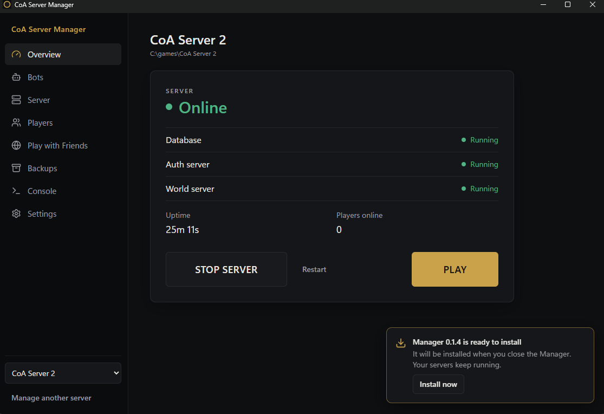
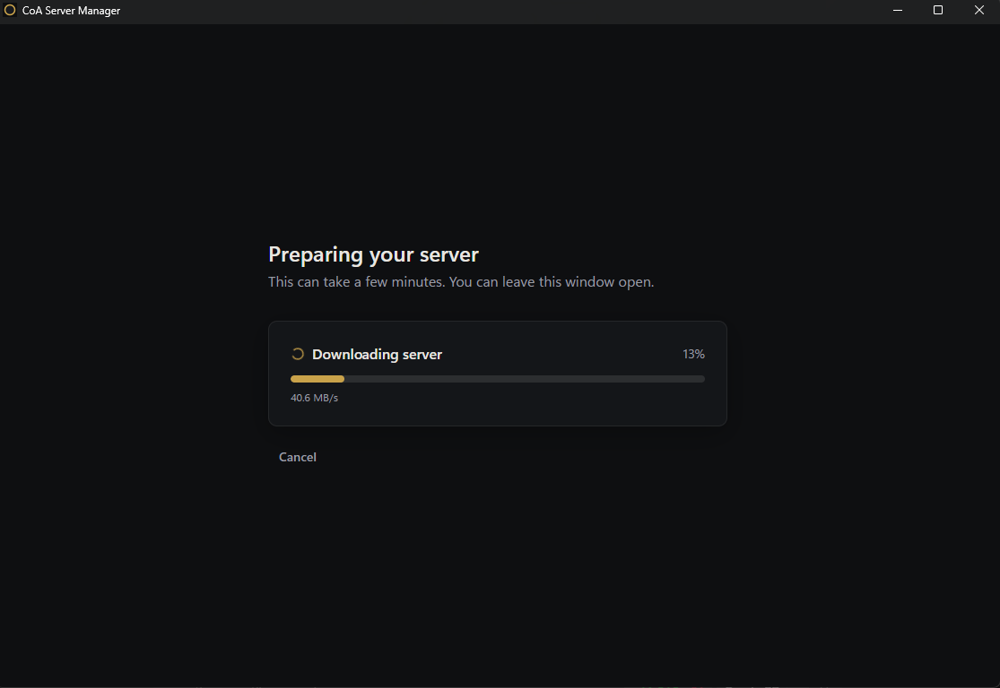
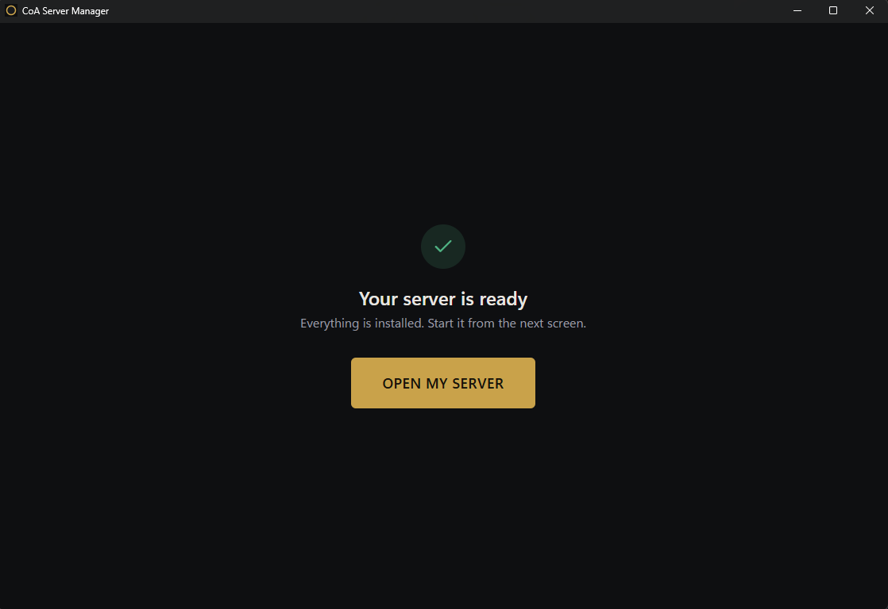
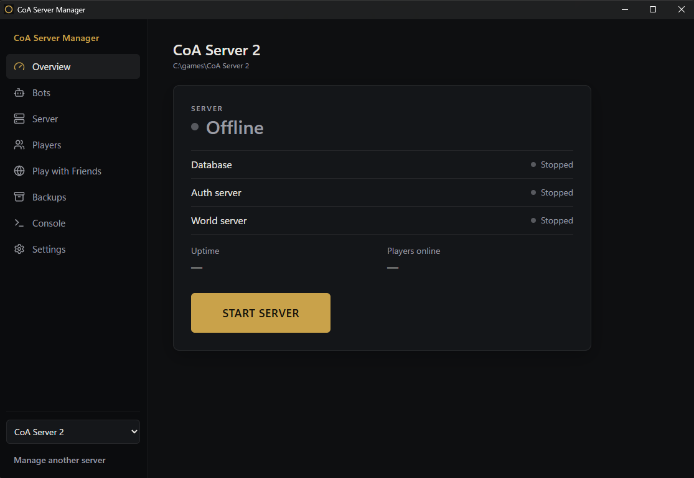
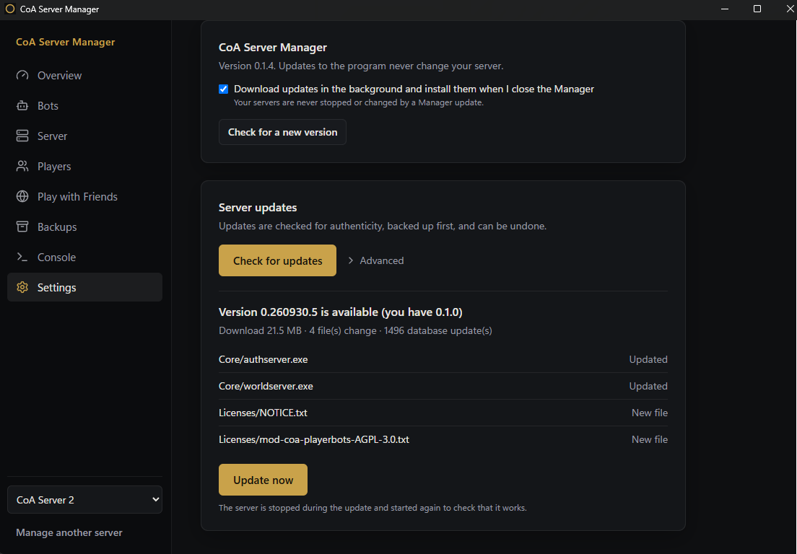
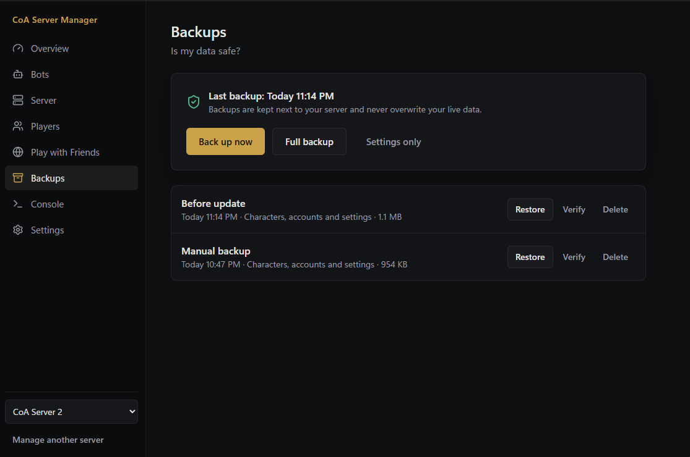

# CoA Server Manager

A Windows app that installs and runs your own **Conquest of Azeroth** server (AzerothCore) with a few clicks:
no console, no config files, no database tools. Tauri 2 + Rust + React.



## What it does

* **One-click install.** Downloads a signed, verified server package (resumable, checked file by file), sets up the
  database and creates your first account. Or import a server you already have.
* **Start / Stop / PLAY.** One button for the whole server (database, auth, world) with live status, uptime and
  players online. PLAY starts the game client with the right realmlist.
* **Game client.** Use the client you already have, or let the Manager download it (about 43 GB, resumable, every file
  verified). A client the Manager looks after is checked for updates like the server: PLAY turns into **UPDATE CLIENT**,
  and files you changed yourself are never replaced unless you say so.
* **Safe updates.** The Manager checks for a new server version on start and every five minutes; the main button turns
  into **UPDATE**. Updates are authenticated (Ed25519), back up first, keep files you changed and can be rolled back.
* **Backups.** Characters, accounts and settings on demand, automatically before every update; verify and restore
  from the app.
* **CoA / Wildcard realms.** Choose the active realm on Overview. A server build with Wildcard support is required;
  the first switch copies world data and creates an empty character database. Accounts are shared, characters and
  module settings are separate, and only one world runs. Switching a running server saves characters and restarts it.
  The closed client's saved realm follows this selection and is checked again before PLAY. If the client is open,
  the change is applied on the next launch through the Manager.
  CoA companions are unavailable on Wildcard; other optional modules are experimental. Backups include both realms,
  and database updates apply to both.
  See [realm profiles and validation](docs/WILDCARD.md).
* **Companions (bots).** Fill the world with level-appropriate bots, see progress, stop spawning, take them offline,
  despawn N to relieve the server, and choose how many log in at server start.
* **Realmlist switcher.** Keep named realmlists (for example *Solo* and *PTR*) and switch the game client between them from a
  drop-down next to PLAY; the file that was replaced is saved first.
* **Accounts.** See everyone who can log in, change passwords and access levels, rename an account.
* **Modules.** A page for the server's optional modules (switch on/off, GitHub, settings); it fills up as modules are added.
* **Report a problem.** A form that prepares a ready bug report for GitHub with your versions filled in.
* **Settings without files.** Bots and Server pages with plain-language options and presets, a console to the world
  server, player list with account tools.
* **Play with friends.** Checks whether your server is reachable, opens firewall rules, finds your router (UPnP),
  supports LAN, direct and private-network (Tailscale) play, with step-by-step guides and a package to send to friends.
* **Updates to the Manager itself** download in the background and install when you close it. Your servers are never
  stopped or changed by a Manager update.
* **Languages:** English, Russian, German, French, Spanish.

| Install | Ready |
|---------|-------|
|  |  |

| Overview | Server updates |
|----------|----------------|
|  |  |



## Install

Download the installer from the [Releases](https://github.com/Corfirean/coa-server-manager/releases) page
and run it. You need about 10 GB of free disk space for the server. The game client (about 43 GB) is separate: point the
Manager at the one you have, or let it download one for you.

## Status

Phases 0–10 of the plan in [docs/ARCHITECTURE.md](docs/ARCHITECTURE.md) are done: foundation, import, start/stop,
config engine, backups, clean install from signed packages, updates, companions, client launch, friends, polish.
Remaining work (translation review by native speakers, optional extras) is listed in section 9 of that document. Translation notes: [docs/TRANSLATIONS.md](docs/TRANSLATIONS.md).

## Develop
```
npm install
cargo test --workspace                 # core logic (scan, fsx, manifest, process, driver, health, updates, ...)
npx tsc --noEmit                       # type check
node tools/check-i18n.mjs              # translation keys and placeholders
npx vite                               # UI in a browser uses a mock IPC (src/dev/mock.ts)
cargo build -p coa-server-manager      # native app (debug build loads http://localhost:1420)
```
Layout: `crates/coa-core` (logic), `crates/coa-release` (package tools: pack, sign, verify), `src-tauri`
(command layer), `src` (UI).

Live checks against a real repack: `cargo run -p coa-core --example scan -- <folder>` (read-only).
Start/stop testing must use a disposable copy: `tools/make-fixture.ps1` builds `C:\games\coa-fixture`
on offset ports from the pristine packaged database. Never run start/stop against a server in use.
`tests/e2e/cdp.mjs` drives the real window through WebView2 remote debugging
(`WEBVIEW2_ADDITIONAL_BROWSER_ARGUMENTS=--remote-debugging-port=9222`).

## License
CoA Server Manager is free software under the [GNU Affero General Public License v3.0](LICENSE) (`AGPL-3.0-only`).

* The server it installs is built from a public fork of AzerothCore
  ([`Corfirean/azerothcore-wotlk-coa`](https://github.com/Corfirean/azerothcore-wotlk-coa)), which keeps its own licences
  (GPL-2.0-or-later for the MaNGOS-derived parts, AGPL-3.0 for AzerothCore-original files), and the
  [`mod-coa-playerbots`](https://github.com/Corfirean/mod-coa-playerbots) module (AGPL-3.0). The exact commits behind every
  package are written into its manifest, so the matching source is always available.
* The bundled MySQL keeps its own GPL-2.0 licence (its text ships in the package's `Licenses` folder).
* The game data in the `Data` folder (`dbc`, `maps`, `vmaps`, `mmaps`) was extracted from the client of the discontinued
  Ascension "Conquest of Azeroth" realm and is **not** covered by this licence.
