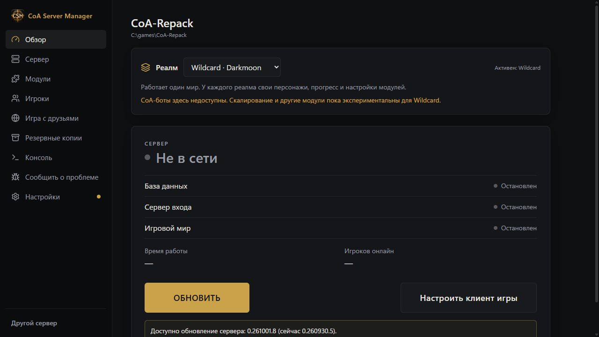
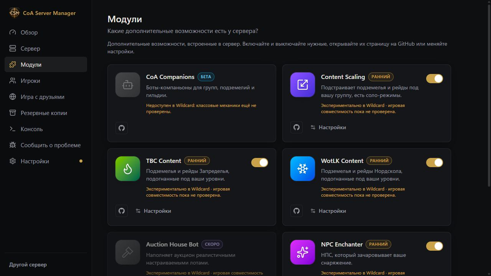

# Realm profiles

Overview offers CoA and Wildcard. The installed worldserver must contain Wildcard support and the database must
already have its Wildcard migrations. The Manager refuses an unsupported binary, an occupied realm ID 2 or an
existing destination database rather than overwrite them.

The first switch copies the CoA world into `acore_world_wildcard` and creates `acore_characters_wildcard` from
the character schema and neutral server seed tables. Existing characters, card collections and progress are not
copied. Accounts remain in shared `acore_auth`. Realm IDs 1 and 2 share the world port; only the selected world
runs, and the inactive realm is listed offline. A switch while running stops the server gracefully and restarts it.

Configuration profiles are saved under `Settings/realm-profiles`. An interrupted switch can restore its previous
configuration from the journal. CoA companion bots cannot be enabled on Wildcard. Content Scaling and the other
optional modules retain their settings but show experimental compatibility; class mechanics need separate gameplay
validation. Switching back restores the CoA module settings.

Quick/database backups include both character databases and shared auth. Full backups also include both worlds.
Recovery points identify their active realm; select that realm before restoring them. Server migrations apply to
both realms, with auth applied once. The server updater can replace its launcher: the Manager reapplies the realm
adapter before the next start.

## Validation for v0.5.0

- `cargo test --workspace`: 178 core tests passed; command layer and examples compiled.
- `npm run build`, translation key checks and changelog validation passed.
- Native disposable fixture on offset ports: fresh Wildcard creation and startup, CoA startup after switching back,
  separate probe values and restored CoA configuration. A second fresh creation verified the arena-season seed fix.
- Full backup verified both worlds, both character databases, shared auth and configurations.
- Native migration probe applied once to each realm and once to auth; repeating it did nothing.
- Restoring Wildcard characters removed a fixture-only change and preserved the CoA probe value.
- Core gameplay wrapper: `VERIFY ALL: PASSED`, gameplay stage only, real clock. First login (7 assertions),
  level rolls/reroll (31), skill card rolls (13), stat path (12). The latter two item-grant scenarios passed on isolated
  reruns after failing in the shared batch; the wrapper records two batch-sensitive cases.
- Browser demo verified active profile, hidden Bots navigation and module compatibility labels. Screenshots show
  mock IPC; native checks above exercised the actual backend and server.

The gameplay harness required fixture-only synchronization of already applied migration history by verified SQL
hashes and its normal Windows module config path. Owned server files and databases were not modified.
